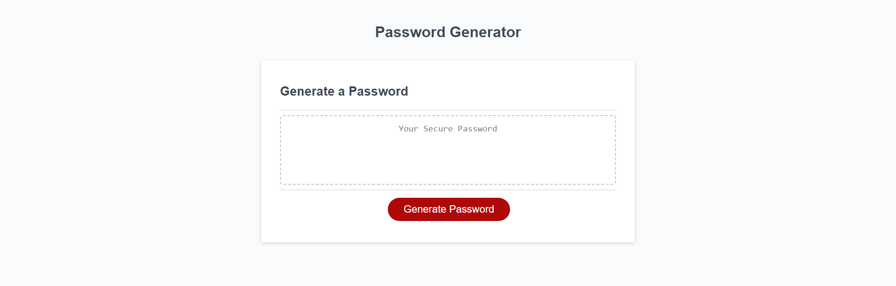
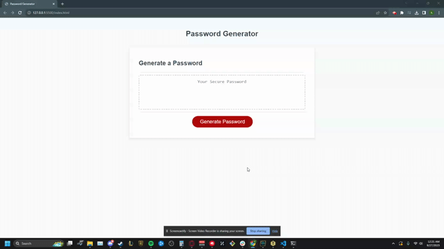
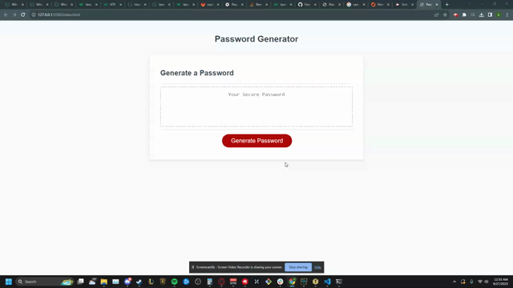

# Password Generator

## Description
This project begins with starter code that sets the styling for the page and tasked us to create the algorithm that generates the password. It also required the prompting of inputs from the user regarding specific characteristics of the password. 

[Deployed Website](https://fenriragni.github.io/pwd-gen/)

## Usage
The Password Generator can be used to generate a random password by choosing specific characteristics.  

If the user chooses a password length that is less than 8 or greater than 128, the generator displays a message informing them the password cannot be that length. If no value is chosen then it outputs you've no chosen no length:

After getting a password length, the app asks the user to confirm which characteristics they want for their password. After each confirmation it validates the user choice. The app then prints the password using the characteristics chosen into the main field:

## Credits

Thanks to [freeCodeCamp](https://www.freecodecamp.org/news/swap-two-array-elements-in-javascript/) to helping me understand how to swap two elements in an array and teaching me that you can make an array of declarations in order to change multiple things at the same time;